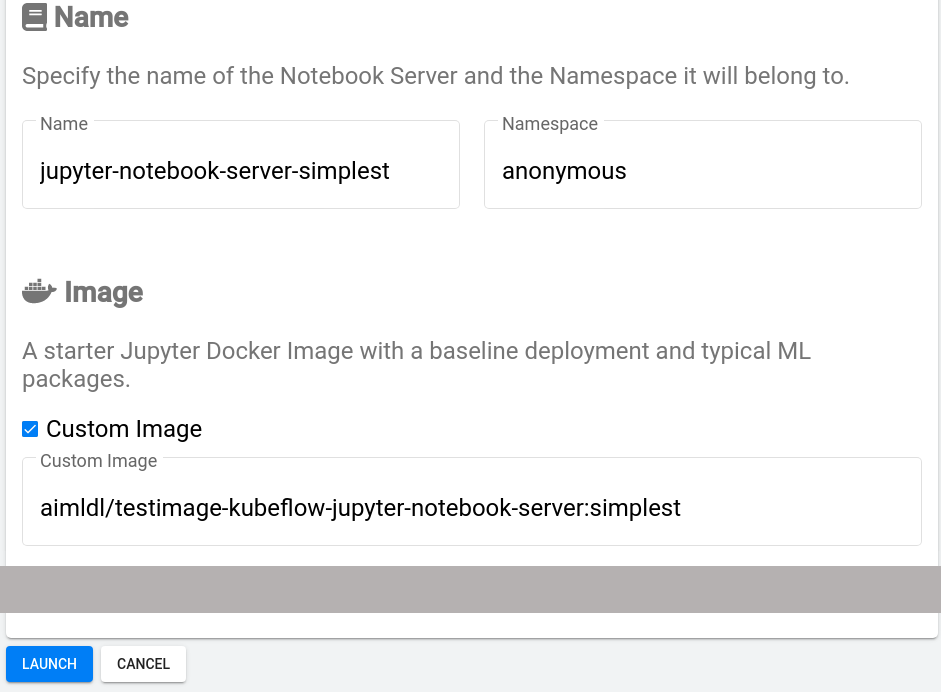
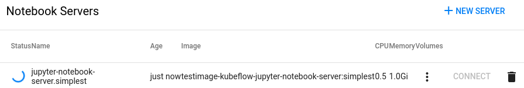
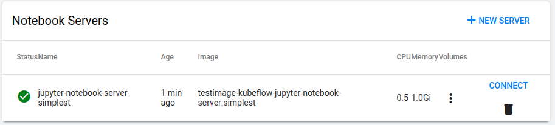

* Rev.2: 2020-04-29 (Wed)
* Rev.1: 2020-04-28 (Tue)
* Draft: 2020-04-27 (Mon)

# 예: Jupyter Notebook Server 런칭하기

지금까지는 Kubeflow에서 Notebook Server를 런칭하는 절차에 대해 알아봤습니다. 이제 `Notebook Servers` 설정 페이지에 어떤 값을 넣어야하는지 구체적인 예를 봅니다. 

Jupyter Notebook Server를 구현하며 Kubeflow 전반에 대한 이해도를 높이기 위해서 아래 표와 같이 4단계로 나눠서 설명하겠습니다. 편의상 Docker Image를 test image와 base image로 타입을 나누어봅니다. 만약 Docker Image와 Jupyter Notebook에 대해 잘 아신다면 중간 단계를 거치지 않고 바로 마지막 단계를 보셔도 괜찮습니다.

| Name                             | Custom Image (Docker Hub Repository:Tag)                   | Type       |
| -------------------------------- | ---------------------------------------------------------- | ---------- |
| jupyter-notebook-server-simplest | aimldl/testimage-kubeflow-jupyter-notebook-server-simplest | test image |
| jupyter-notebook-server-simpler  | aimldl/testimage-kubeflow-jupyter-notebook-server:simpler  | test image |
| jupyter-notebook-server-simple   | aimldl/testimage-kubeflow-jupyter-notebook-server:simple   | test image |
| jupyter-notebook-server          | aimldl/testimage-kubeflow-jupyter-notebook-serverlatest    | base image |

4개의 예제를 시작하기 전에 `Notebook Servers` 페이지에서

 `Select namespace`를 anonymous로 선택합니다. 그러면 이 네임스페이스 아래에 만들어진 노트북 서버와 상태를 볼 수 있습니다.

$ docker run -it --name simplest aimldl/testimage-kubeflow-jupyter-notebook-server-simplest bash
root@adc93dba55ea:~# 처음이므로 아래와 같이 보입니다.

예제를 시작하기 위해서 `+ NEW SERVER`를 클릭해서 설정 페이지를 오픈합니다. 좌측 상단의 `Select namespace` 대신 `anonymous`가, `Name` 항목의 `Namespace` 박스에 `anonymous`가 자동 입력되었음을 알 수 있습니다.

`$ docker run -it --name simplest aimldl/testimage-kubeflow-jupyter-notebook-server-simplest bash
root@adc93dba55ea:~# ❏ Custom Image`의 `❏`를 클릭합니다.

### (1) Simplest Jupyter Notebook Server 런칭하기

아래와 같이 입력한 후 `LAUNCH` 버튼을 눌러서 노트북 서버를 만듭니다.

`Notebook Server` 페이지에 생성 중인 `NEW SERVER`의 상태 정보가 나는데, 정상적으로 진행될 경우 Status에 마우스 포인터를 얹으면 `PodInitializing`이라는 메세지를 보여줍니다. 

서버 생성이 정상적으로 종료되면 `CONNECT`가 활성화됩니다. 이때 Status에 마우스 포인터를 얹으면 Running이라고 나옵니다.

`CONNECT`를 클릭하면 Jupyter Notebook이 열리므로 이용하시면 됩니다.

오랜 시간이 지나도 `CONNECT`가 활성화되지 않는다면 Status 아래에 마우스 포인터를 올려놓으면 메세지를 볼 수 있습니다. 에러 메세지에 맞게 문제를 해결해야 합니다. 몇가지 대표적인 에러의 경우 다음을 참고하세요.

* [Codelabs, Workshops, and Tutorials](https://www.kubeflow.org/docs/examples/codelabs-tutorials/),  [Documentation](https://www.kubeflow.org/docs/)
* [Introduction to the Pipelines SDK](https://www.kubeflow.org/docs/pipelines/sdk/sdk-overview/),  [Documentation](https://www.kubeflow.org/docs/)

### 요약

위의 예제의 내용을 요약합니다. 설정 페이지의 Name 항목에 지정하고 싶은 이름을, Custom Image에 항목에 `Docker Hub Repository`정보를 입력하고 `LAUNCH` 버튼을 누르면 주어진 이미지를 바탕으로 Notebook Server를 만들게 됩니다. 이 과정에서 Kubernetes Cluster에 주어진 이미지를 바탕으로 Pod가 만들어집니다.

------

다음: [Troubleshooting / 에러 메세지 처리](../troubleshoot/launch_a_jupyter_notebook_server.md)
