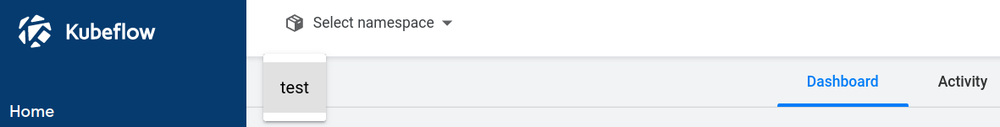

* Rev.2: 2020-04-28 (Tue)
* Rev.1: 2020-04-14 (Tue)
* Draft: 2020-04-13 (Mon)

References

* [Central Dashboard](https://www.kubeflow.org/docs/components/central-dash/overview/), [Registration Flow](Registration Flow)

# Kubeflow UI 소개

#### 쿠브플로우 센트럴 대쉬보드 (Kubeflow Central Dashboard)에 접속하기

Kubeflow는 관리를 위한 대쉬보드 기능을 제공합니다. 커맨드 라인이 아닌 UI (User Interface)이므로 이 대쉬보드를 Kubeflow UI라고 부르기도 합니다. 설치가 완료되어 Kubeflow가 동작하므로 Kubeflow에 익숙해지기 위해 먼저 대쉬보드에 접속해봅니다. 이 과정을 통해 Kubeflow에서 제공하는 서비스에 대한 큰 그림 또한 이해할 수 있습니다.

##### 표준 설정

Kubeflow는 (1) 표준, (2) DEX 두가지 인증모드가 있습니다. 먼저 표준 설정으로 인증해보고, 나중에 다중 사용자를 지원하는 DEX설정으로 인증해봅니다.

표준 설정일 경우 아래 명령어를 실행해서 로컬로 포트 포워딩을 합니다.

```bash
$ kubectl port-forward -n istio-system svc/istio-ingressgateway 8080:80
Forwarding from 127.0.0.1:8080 -> 80
Forwarding from [::1]:8080 -> 80
Handling connection for 8080
Handling connection for 8080
```

> 참고로 이름을 지정하는 -n옵션의 위치가 바뀌어도 괜찮습니다. 아래의 예에서는 ***-n istio-system***가 뒤로 빠졌습니다.
>
> $ kubectl port-forward svc/istio-ingressgateway -n istio-system 8080:80

##### 대쉬보드 첫 화면

표준 설정의 경우 웹브라우저의 주소창에 http://localhost:8080 를 입력합니다.


Step 1. "Start Setup" 버튼을 클릭하면 Namespace를 입력하는 창이 있습니다. Kubeflow 서비스에서 생성된 자원들을 하나의 네임스페이스에 모아놓게 됩니다.


Step 2. 원하는 Namespace를 입력하고 "Finish" 버튼을 누르면 대쉬보드로 전환됩니다. 기본적으로 (Default) anonymous (익명의 게스트)가 자동입력 되므로 처음에는 anonymous로 설정을 하고, 익숙해지면 Namespace를 변경해봅니다.

#### 

예를 들어 Namespace에 test라고 입력할 경우


대시보드의 `Select namespace`를 클릭하면 `test`라는 것이 보입니다.



Namespace는 실질적으로 운용을 할 때 그룹을 지정할 때 쓰일 수 있습니다. Namespace가 달라지면 권한이 달라지기 때문입니다. 여러 개의 팀, 프로젝트, 고객 등이 있을 경우 각각 다른 Namespace를 지정해주는 것만으로 Access권한부터 실행권한까지 달라지기 때문에 운용 시 다른 여러개 그룹을 편리하게 관리할 수 있습니다.

첫 실행시에는 anonymous로 지정합니다. 만약 다른 Namespace를 지정할 경우, 다음부터 원하는대로 동작하지 않을 수 있으므로 주의가 필요합니다.

## 대쉬보드 실행하기

대쉬보드를 실행하는 방법을 정리해봅니다. 

##### Step 1. 터미널에서 대쉬보드 서버를 동작하는 명령어를 실행합니다.

```bash
$ kubectl port-forward svc/istio-ingressgateway -n istio-system 8080:80"
Forwarding from 127.0.0.1:8080 -> 80
Forwarding from [::1]:8080 -> 80
```

##### Step 2. 웹브라우저의 주소창에 아래의 URI를 입력합니다.

> http://localhost:8080 

그러면 대쉬보드에 접속할 수 있습니다. 북마크에 추가하면 더 편리하게 접속 가능합니다.


이것은 로컬에서 서버를 띄우고 웹브라우저를 클라이언트로 이용해서 접속하는 방식입니다. 명령어를 매번 입력하기는 번거롭고 잊어버릴 수도 있습니다. 대쉬보드는 자주 사용하기 때문에 보다 간단하게 접속할 수 있도록 명령어를 `kfui` 간단하게 바꿔봅니다.

### alias 설정하기

자주 호출하는 명령어이므로 편의상 alias를 설정합니다. 터미널에 일시적으로 설정하거나 재부팅 시에도 영속적으로 적용되도록 설정할 수 있습니다.

##### 표준 설정을 위한 alias 설정

일시적으로 설정하기 위해선 터미널에서 alias 명령어를 실행하면 됩니다. 터미널을 빠져나오거나 다른 터미널이 실행될 경우에는 무효화됩니다.

##### Step 1. alias 명령어 설정하기

```bash
$ source <(kubectl completion bash)
$ alias kfui="kubectl port-forward svc/istio-ingressgateway -n istio-system 8080:80"
```

##### Step 2. 설정된 alias 명령어 실행하기

alias를 통해 표준 설정 및 DEX 인증 설정 모두 동일한 명령어로 대시보드를 실행할 수 있습니다.

```bash
$ kfui
Forwarding from 127.0.0.1:8080 -> 80
Forwarding from [::1]:8080 -> 80
```

설정된 alias 명령어인 `kfui`가 실행 될 때는 설정된 값인 `kubectl port-forward svc/istio-ingressgateway -n istio-system 8080:80`로 치환된 후 실행됩니다. 실질적으론 앞에서 총 2단계로 실행한 것과 동일하지만, `kfui`로 명령어를 치환하고 여러번 실행할 경우에 편리합니다. 딱 한번만 실행할 예정이라면 굳이 `alias`로 바꿀 필요는 없겠죠.

##### Step 3. 웹브라우저에 URI입력하기

> http://localhost:8080 


위에서 설정한 `alias`를 재부팅 후에도 유효하도록 설정하면 여러모로 편리합니다. 이제는 `kfui`라는 명령어만 기억하면 되기 때문이죠. Linux에서 이렇게 설정을 하기 위해서는 `.bashrc` 혹은 `.bash_profile`에 저장하게 됩니다.

##### Step 1. 텍스트 편집기로 .bashrc를 연다.

```bash
$ nano ~/.bashrc
```

##### Step 2. 파일에 아래와 같이 입력한다.

편의 상 파일의 제일 아래에 입력합니다.

```bash
# kubeflow
source <(kubectl completion bash)
alias kfui="kubectl port-forward svc/istio-ingressgateway -n istio-system 8080:80"
```

##### Step 3. 변경사항을 적용한다.

```bash
$ source ~/.bashrc
```

현재 실행 중인 터미널에 변경사항이 적용되었다면 새로운 alias가 적용되었을 겁니다. 만약 이 단계에서 오류 메세지가 보이면 수정해야 합니다. 

##### Step 4. 적용 여부를 확인한다.

간단하게 `kfui` 명령어가 실행되는지 확인할 수 있습니다.

```bash
$ kfui
Forwarding from 127.0.0.1:8080 -> 80
Forwarding from [::1]:8080 -> 80
```

혹은 새로운 `alias`명령어가 설정되었는지 아래처럼 확인할 수도 있습니다.

```bash
$ alias | grep kfui
alias kfui='kubectl port-forward svc/istio-ingressgateway -n istio-system 8080:80'
$
```

### DEX 인증 설정 [TODO]

DEX 인증 설정의 경우 다음 명령어로 접속주소를 얻을 수 있습니다. 첫 실행 때는 설정하는데 3~5분 정도 소요됩니다.

```bash
$ kubectl get ingress -n istio-system
NAMESPACE     ...  ADDRESS  ...
istio-system  ...  a743484b-istiosystem-istio-2af2-xxxxxx.us-west-2.elb.amazonaws.com  ...
```

이 접속 주소를 복사해서 웹브라우저의 주소창에 입력합니다.

##### DEX 인증 설정을 위한 alias 설정

```bash
$ source <(kubectl completion bash)
$ alias kfui="kubectl get ingress -n istio-system"
```

[TODO] Image로 Hello, world를 실행하는 방법을 기록하는 문서를 만들기, Official website에 있는 것과 비슷.

https://www.kubeflow.org/docs/notebooks/setup/


다음: 

* [요약: Kubeflow Central Dashboard 들어가기](summary-kubeflow_dashboard.md)
