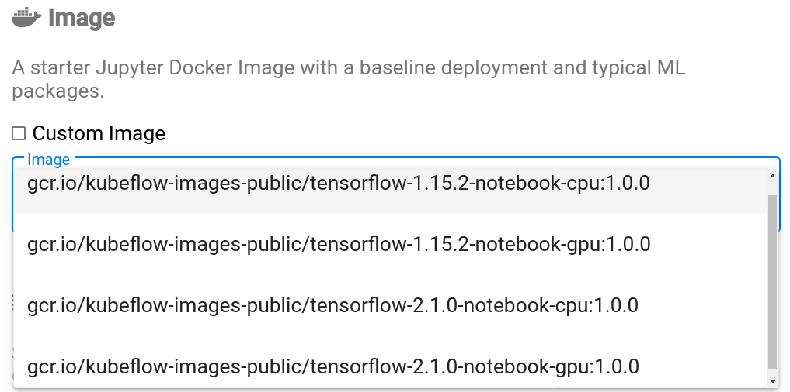

* Rev.1: 2020-05-22 (Fri)
* Rev.1: 2020-04-28 (Tue)
* Draft: 2020-04-27 (Mon)

# 개요: Kubeflow의 `Notebook Servers`

* (현 시점에) 공식 문서에는 다루지  않거나, 정보의 양이 부족하거나, 정리가 덜 되어 있는 내용이 포함되어 있습니다.
* [Documentation / Jupyter Notebooks / Set Up Your Notebooks](https://www.kubeflow.org/docs/notebooks/setup/)에는 Kubeflow 기본 이미지를 선택해서 `my-first-notebook`이라는 이름의 노트북 서버를 만들고, TensorFlow로 `hello world`프로그램을 실행시키는 예제까지만 나옵니다.
* [Documentation / Jupyter Notebooks / Create a Custom Jupyter Image](https://www.kubeflow.org/docs/notebooks/custom-notebook/)에는 커스텀 이미지를 만드는 내용을 다루지만 내용이 정리되어 있지 않고 불충분합니다. 물론 이 내용을 바탕으로 Docker 커스텀 이미지를 만들었지만 예제가 있으면 좋겠다는 생각이 듭니다.
* 인터넷에 극소수의 몇 가지 예제를 다루는 글이 있지만 잘 정리가 되어 있지 않습니다.
  * Google search: kubeflow create a custom image and notebook servers
  * [KubeFlow Custom Jupyter Image (+ github for notebook source control)](https://andrewm4894.com/2019/10/20/kubeflow-custom-jupyter-image-github-for-notebook-source-control/), andrewm4894
    * https://github.com/andrewm4894/my_utils
    * [andrewm4894/my-kf-jupyter](https://hub.docker.com/r/andrewm4894/my-kf-jupyter), DockerHub

*  결론적으로 잘 쓰여진 Tutorial이 없어서 직접 씁니다. 커스텀 이미지를 선택해서 노트북 서버를 만드는 예제에 대해 조금 상세히 다뤄봅니다.

### `Notebook Servers` 메인 메뉴 들어가기

Kubeflow Dashboard 왼쪽 메뉴에서 `Notebook Servers`를 선택하면

`Notebook Servers` 메인 메뉴가 열립니다.

메인 메뉴에서는 신규 노트북 서버의 생성 및 기존 서버의 모니터링이 가능합니다.

#### Namespace 선택

상단의 `Select namespace`를 클릭하면 현재 등록된 namespace가 나오므로 선택하면 됩니다.

#### `NEW SERVER` 생성

우측의 `+ NEW SERVER` 버튼을 누르면 신규 노트북 서버를 만들 수 있습니다. 이 신규 서버 생성 메뉴의 시작 부분은 아래와 같습니다. 이 경우 아직 namespace가 선택되지 않았기 때문에 `Select namespace`라고 나옵니다. `Name`항목에 노트북 서버의 이름을 입력하고, 노트북 프로그램이 깔려있는 컨테이너 이미지 등을 설정해주면 서버가 생성됩니다. 

`Name`항목에 아래 `Namespace`는 사용자가 입력하지 않고, Namespace를 선택하면 자동으로 입력됩니다. 

##### 예: `anomymous` 네임스페이스에 my-first-notebook 이름 입력하기

`Namespace`를 `anonymous`로 선택해주면

`anonymous`라고 자동으로 입력됩니다.

서버의 이름을 my-first-notebook라고 입력을 해봅니다. 

[TODO]: 이미지 바꾸기. Name이 틀렸음.

참고로 `Name`항목이 비어있는 동안 화면 아래의 `Launch` 버튼이 비활성화됩니다.

`Name`항목이 입력되면 `launch`버튼이 활성화되고, 아래 부분의 설정을 마친 후 이 버튼을 누르면 노트북 서버가 런칭됩니다.

### 새로운 노트북 서버를 만들기 위한 두 가지 방법

노트북 서버를 만드는 방법은 Image 선택에서 두 가지로 나뉩니다. 

1. Kubeflow 기본 이미지 (Default Image)
2. 커스텀 이미지 (Custom Image)

#### 기본 이미지 (Default Image) 선택

`❏ Custom Image` 아래의 드랍다운 메뉴를 클릭하면 4개의 기본 이미지가 보입니다. 

이 중 하나를 클릭하면 기본 이미지가 선택됩니다. 4개의 기본 이미지는 아래 표처럼 구분됩니다. 구글의 머신러닝 라이브러리 TensorFlow의 버전 (1.x 혹은 2.x)과 GPU 사용여부 (CPU 혹은 GPU)로 구분되는 대략적인 이름입니다.

| tensorflow 버전 \ GPU사용 여부 | CPU                         | GPU                         |
| ------------------------------ | --------------------------- | --------------------------- |
| 1                              | tensorflow-1.*-notebook-cpu | tensorflow-1.*-notebook-gpu |
| 2                              | tensorflow-2.*-notebook-cpu | tensorflow-2.*-notebook-gpu |

전체 이름은 아래와 같습니다.

| Image Name                                                   | TensorFlow Version | CPU/GPU |
| ------------------------------------------------------------ | ------------------ | ------- |
| gcr.io/kubeflow-images-public/tensorflow-1.15.2-notebook-cpu:1.0.0 | 1.x                | CPU     |
| gcr.io/kubeflow-images-public/tensorflow-1.15.2-notebook-gpu:1.0.0 | 1.x                | GPU     |
| gcr.io/kubeflow-images-public/tensorflow-2.1.0-notebook-cpu:1.0.0 | 2.x                | CPU     |
| gcr.io/kubeflow-images-public/tensorflow-2.1.0-notebook-gpu:1.0.0 | 2.x                | GPU     |

> ##### Q: 어느 이미지를 선택해야 하는가?
>
> **A:** 
>
> * 잘 모르겠다면 첫 번째 이미지 (TensorFlow version 1.x 및 CPU)를 선택하면 됩니다. 
>
> * 간단한 테스트를 위해서는 CPU를 선택하면 됩니다.
> * GPU를 선택할 경우 쿠버네티스 클러스터의 워커 노드가 GPU를 지원해야 합니다.

#### 커스텀 이미지 (Custom Image) 선택

`❏ Custom Image`의 `❏`를 체크하고

`Custom Image`바로 변경된 입력창을 클릭하면 custom image를 제공하라고 문구가 변경됩니다.

custom image의 위치를 입력하고 아래의 `launch`버튼을 누르면 노트북 서버가 런칭됩니다.

------

구체적으로 어떤 값을 넣는지는 어떤 커스텀 이미지를 만드는지에 따라 달라집니다. 보다 상세한 내용을 다음에 알아봅니다.

* 다음: [커스텀 도커 이미지 만들기](#create and use a custom image.md)
