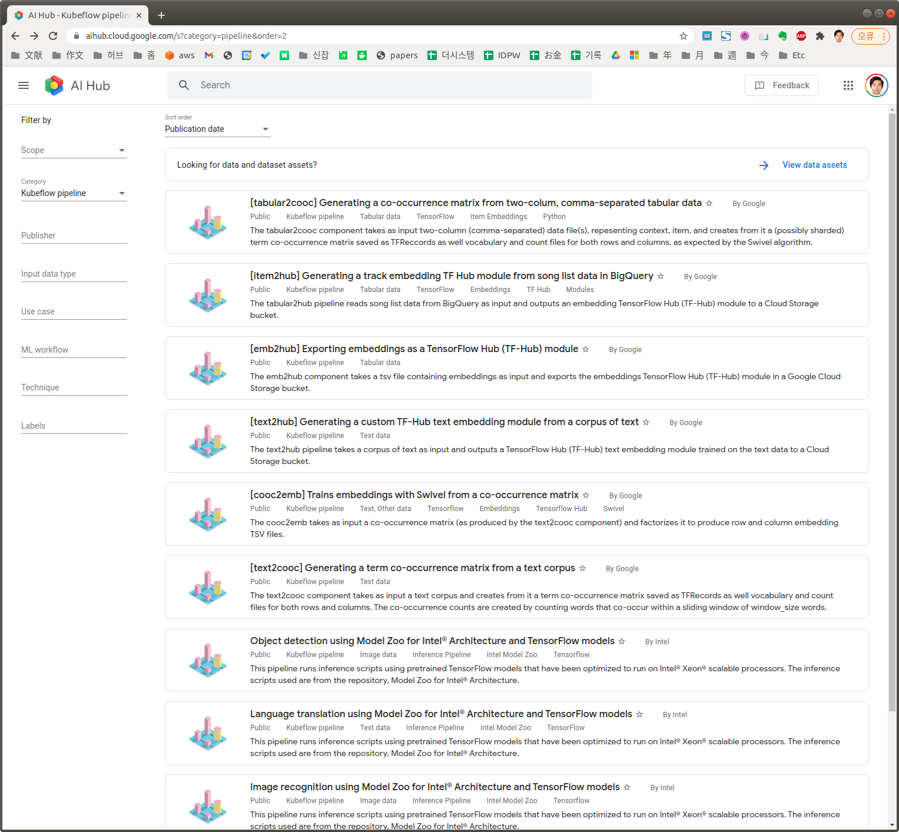

# AI Hub

[Build, Train, and Deploy XGBoost model using Kubeflow Fairing](https://aihub.cloud.google.com/p/products%2F37f618e1-d0c3-48c3-85fe-ebb85173a621)

[Running a distributed XGBoost training on CPUs or GPUs](https://aihub.cloud.google.com/p/products%2F067176a1-c5ca-4f7b-bace-37790cc9676a)

* Sample notebook
  * [XGBoost Abalone example](https://storage.googleapis.com/kf-pipeline-contrib-public/ai-hub-assets/xgboost-dist-gpu-training/example.ipynb)

[Training a KNN classifier using FAISS on CPUs or GPUs](https://aihub.cloud.google.com/p/products%2Fb4d8058e-749f-410c-ac45-b9b3049d049d)

[Training using the PCA algorithm with TensorFlow](https://aihub.cloud.google.com/p/products%2F0aa58071-0153-4081-86d3-a958f4007824)

[Data preparation by converting CSV files to the TFRecord format](https://aihub.cloud.google.com/p/products%2F85bbcfb2-a7f9-4203-ad2d-8278f066f2cc)

https://aihub.cloud.google.com/s?category=pipeline&order=2

