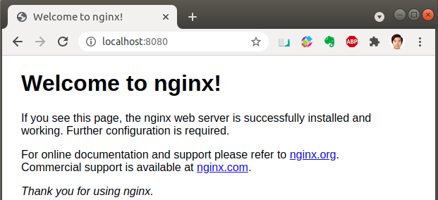
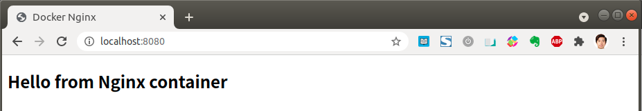

* Draft: 2021-05-03 (Mon)

# Test On-Prem Kubernetes Cluster with Nginx


The target is to upload a Docker image and run a Nginx server on Kubernetes.

[Kubernetes Documentation](https://kubernetes.io/docs/) > [Tasks](https://kubernetes.io/docs/tasks/) > [Run Applications](https://kubernetes.io/docs/tasks/run-application/) > [Run a Stateless Application Using a Deployment](https://kubernetes.io/docs/tasks/run-application/run-stateless-application-deployment/)


## Prerequisites

* docker has already been installed on a local machine.


Download the Docker official Nginx image

https://hub.docker.com/_/nginx

```bash
$ docker pull nginx
  ...
Status: Downloaded newer image for nginx:latest
docker.io/library/nginx:latest
$
```

Check if the image exists in the local machine.

```bash
$ docker images
REPOSITORY                           TAG                      IMAGE ID       CREATED         SIZE
nginx                                latest                   62d49f9bab67   2 weeks ago     133MB
  ...
$
```

Save the image into a .tar file.

```bash
$ docker save nginx > nginx.tar
$ ls
nginx.tar
$
```

Refer to the [docker save](https://docs.docker.com/engine/reference/commandline/save/) command for more information about the usage.

> Google search: nginx docker image hello world
>
> * [How To Use the Official NGINX Docker Image, Peter McKee, 2020-08-13](https://www.docker.com/blog/how-to-use-the-official-nginx-docker-image/), docker blog

The following part is the hands-on of the above link.

Run the image. The `-d` option runs the container as a daemon and the `-p 8080:80` option publishes port 8080 on the host network.

```bash
$ docker run -it --rm -d -p 8080:80 --name web nginx
5c3cbe6518cfd8399124f833db6e73598a6854e638093d242a46aaef6e3e70ba
$ docker ps
CONTAINER ID   IMAGE                    COMMAND                  CREATED          STATUS          PORTS                                   NAMES
5c3cbe6518cf   nginx                    "/docker-entrypoint.…"   19 seconds ago   Up 17 seconds   0.0.0.0:8080->80/tcp, :::8080->80/tcp   web
$
```

Open a web browser and navigate to `http://localhost:8080`.



The welcome page is open by default. You can tell the nginx daemon is up and running now.

Stop the container for now.

```bash
$ docker stop web
$ docker ps
CONTAINER ID   IMAGE                    COMMAND                  CREATED          STATUS          PORTS                                   NAMES
  ...
$
```

The container `web` has stopped.

Now let's add a custom HTML.

> By default, Nginx looks in the `/usr/share/nginx/html` directory inside of the container for files to serve. We need to get our html files into this directory. A fairly simple way to do this is use a mounted volume. With mounted volumes, we are able to link a directory on our local machine and map that directory into our running container.

Create an `index.html` file in a directory `site-content`.

```bash
$ cd 
$ mkdir site-content
$ cd site-content
$ nano index.html
$ ls site-content/
index.html
$
```

```html
<!doctype html>
<html lang="en">
<head>
  <meta charset="utf-8">
  <title>Docker Nginx</title>
</head>
<body>
  <h2>Hello from Nginx container</h2>
</body>
</html>
```

Run the container with the `-v` option to mount a volume.

```bash
$ docker run -it --rm -d -p 8080:80 --name web -v ~/site-content:/usr/share/nginx/html nginx
1005db4c7637b90e322cd389f209802dbe0dd685264a8bb4ec35101838c07de5
$
```

```bash
$ docker ps
CONTAINER ID  IMAGE  COMMAND                  CREATED         STATUS         PORTS                                  NAMES
1005db4c7637  nginx  "/docker-entrypoint.…"   52 seconds ago  Up 51 seconds  0.0.0.0:8080->80/tcp, :::8080->80/tcp  web
  ...
$
```

Open a web browser and navigate to `http://localhost:8080`. 



Now a new `index.html` is shown.

Stop the Docker container for now

```bash
$ docker stop web
```

Otherwise the port will collide in the next problem. For example,

```bash
$ docker run -it --rm -d -p 8080:80 --name web webserver
  ...
 (a5aebdef2763e9d79b1a00dd47505c6859e61be5ee63ec1403f692ff87c6c1f4): Bind for 0.0.0.0:8080 failed: port is already allocated.
$
```

## Build custom Nginx image

Create a Docker file.

```Dockerfile
FROM nginx:latest
COPY ./index.html /usr/share/nginx/html/index.html
```

Build a new image with a tag webserver. The Dockerfile copies `index.html` file into the Docker image in the specified directory.

```bash
$ docker build -t webserver .
Sending build context to Docker daemon  137.4MB
Step 1/2 : FROM nginx:latest
 ---> 62d49f9bab67
Step 2/2 : COPY ./index.html /usr/share/nginx/html/index.html
 ---> b20db6ddce44
Successfully built b20db6ddce44
Successfully tagged webserver:latest
$
```

Let's double-check to see if the image has been created.

```bash
$ docker images
REPOSITORY                           TAG                      IMAGE ID       CREATED         SIZE
webserver                            latest                   b20db6ddce44   5 minutes ago   133MB
  ...
$
```


Run the image.

```bash
$ docker run -it --rm -d -p 8080:80 --name web webserver
f442ea3ea3cc9fbf73aefa6b7568ce7c8a0295038b0ac9a356993a01d7b6e52e
$
```

Again open http://localhost:8080/. 


The same `Hello from Nginx container` is shown without mounting the volume because the `index.html` is built into the image.

Stop the Docker container to finish up the work.

```bash
$ docker stop web
```


```bash

```

