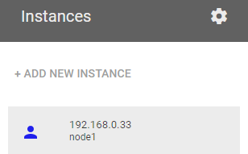
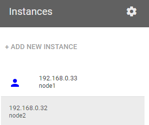
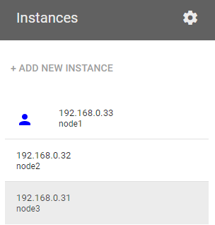

* Draft: 2021-03-17 (Wed)

# 1. 환경 설정


## 1.1. 마스터 노드 설정

Step 1. `ADD NEW INSTANCE`를 클릭해서 인스턴스를 생성합니다.



```bash
  WARNING!!!!

 This is a sandbox environment. Using personal credentials
 is HIGHLY! discouraged. Any consequences of doing so, are
 completely the user's responsibilites.

 You can bootstrap a cluster as follows:

 1. Initializes cluster master node:

 kubeadm init --apiserver-advertise-address $(hostname -i) --pod-network-cidr 10.5.0.0/16


 2. Initialize cluster networking:

kubectl apply -f https://raw.githubusercontent.com/cloudnativelabs/kube-router/master/daemonset/kubeadm-kuberouter.yaml


 3. (Optional) Create an nginx deployment:

 kubectl apply -f https://raw.githubusercontent.com/kubernetes/website/master/content/en/examples/application/nginx-app.yaml


                          The PWK team.


[node1 ~]$
```

Step 2. `kubeadm init` 명령어로 클러스터 생성

아래 명령어는 쿠버네티스 클러스터를 생성합니다.

```bash
$ kubeadm init --apiserver-advertise-address $(hostname -i) --pod-network-cidr 10.5.0.0/16
```

전체 출력 메세지는 [`kubeadm init`의 Full Message](appendix/01-kubeadm_init-full_message.md)를 참고하세요.

Step 3. 클러스터에 파드 네트워크 배치하기

출력 메세지에 다음과 같은 부분이 있습니다.

> You should now deploy a pod network to the cluster. Run
>
> ```bash
> kubectl apply -f [podnetwork].yaml
> ```
>
> with one of the options listed at:
>
>  https://kubernetes.io/docs/concepts/cluster-administration/addons/

위의 링크는 [Installing Addons](https://kubernetes.io/docs/concepts/cluster-administration/addons/)으로 지원되는 Networking and Network Policy의 리스트가 있습니다.

* ACI, Calico, Canal, ..., Weaver Net 등 16개가 있습니다.

이 중에 아래의 명령어를 실행합니다.

```bash
$ kubectl apply -f https://raw.githubusercontent.com/cloudnativelabs/kube-router/master/daemonset/kubeadm-kuberouter.yaml
```

Step 4. 노드 확인하기

```bash
$ kubectl get nodes
NAME    STATUS   ROLES                  AGE   VERSION
node1   Ready    control-plane,master   13m   v1.20.1
$
```

현재 마스터 노드가 `node1`에 준비 (Ready)되었음을 확인할 수 있습니다.

Step 5. 클러스터 정보 확인하기

```bash
$ kubectl cluster-info
Kubernetes control plane is running at https://192.168.0.33:6443
KubeDNS is running at https://192.168.0.33:6443/api/v1/namespaces/kube-system/services/kube-dns:dns/proxy

To further debug and diagnose cluster problems, use 'kubectl cluster-info dump'.
$
```


## 1.2. 워커 노드 1 생성

Step 1. `ADD NEW INSTANCE`를 클릭해서 인스턴스를 생성합니다.




```bash

                          WARNING!!!!

 This is a sandbox environment. Using personal credentials
 is HIGHLY! discouraged. Any consequences of doing so, are
 completely the user's responsibilites.

 You can bootstrap a cluster as follows:

 1. Initializes cluster master node:

 kubeadm init --apiserver-advertise-address $(hostname -i) --pod-network-cidr 10.5.0.0/16


 2. Initialize cluster networking:

kubectl apply -f https://raw.githubusercontent.com/cloudnativelabs/kube-router/master/daemonset/kubeadm-kuberouter.yaml


 3. (Optional) Create an nginx deployment:

 kubectl apply -f https://raw.githubusercontent.com/kubernetes/website/master/content/en/examples/application/nginx-app.yaml


                          The PWK team.


[node2 ~]$
```

Step 2. token 확인하기


```bash
$ kubectl -n kube-system describe $(kubectl -n kube-system get secret -n kube-system -o name | grep namespace) | grep token
Name:         namespace-controller-token-v65fl
Type:  kubernetes.io/service-account-token
token:      eyJhbGciOiJSUzI1NiIsImtpZCI6IjBxazJsZERQeHY2YUp0NkhvZUYzUTRCUUdhYnJwam85RndUNjJOckNlaDgifQ.eyJpc3MiOiJrdWJlcm5ldGVzL3NlcnZpY2VhY2NvdW50Iiwia3ViZXJuZXRlcy5pby9zZXJ2aWNlYWNjb3VudC9uYW1lc3BhY2UiOiJrdWJlLXN5c3RlbSIsImt1YmVybmV0ZXMuaW8vc2VydmljZWFjY291bnQvc2VjcmV0Lm5hbWUiOiJuYW1lc3BhY2UtY29udHJvbGxlci10b2tlbi12NjVmbCIsImt1YmVybmV0ZXMuaW8vc2VydmljZWFjY291bnQvc2VydmljZS1hY2NvdW50Lm5hbWUiOiJuYW1lc3BhY2UtY29udHJvbGxlciIsImt1YmVybmV0ZXMuaW8vc2VydmljZWFjY291bnQvc2VydmljZS1hY2NvdW50LnVpZCI6IjIxZDVjZGU1LTEzYTEtNDQ2ZS1hZWQzLTY5NzVlNzY1OTk1ZCIsInN1YiI6InN5c3RlbTpzZXJ2aWNlYWNjb3VudDprdWJlLXN5c3RlbTpuYW1lc3BhY2UtY29udHJvbGxlciJ9.cfRpv19vqHY1p2lFitZ3Qsdi_pYrKgD-7XnCgMwhnILNWtQm-xy_P0VX17jnMspM8mCEzBukOqiY6YCQhbI_K6JoOETl9joKoNtYHvzDnZkGKGbqSANKGzbuR1qSJcQsNFgczo0ixI8WPEqcd1jTs24cwWkrQj4KH8cjbVXCr2UtEqUa_63ZGfiX2jLkeFlIdS9-RqrLiaFWMjwG1Usd2PO1tFQCcg-NHCk71F5_TjHyoKlgt1_PdQVlUSHAbfEDlL7ac-UOfnnRtsHMp1BOfDsDYO32ETERKgj08UoB4k6BpTPrZAvESX1EqQvRYHtFN6GrzkBcFK9561b1DiW3-w
$
```


Step 3. 노드를 쿠버네티스 클러스터에 붙이기


```bash
$ kubeadm join 192.168.0.33:6443 --token 4yeuuf.fuugdz7wmm0gkago  --discovery-token-ca-cert-hash sha256:cc2db7078ea7038b273d3790927e6b79fca307c9151fcb1386ed02ceaa18e354
```

[`kubeadm join`의 Full Message](trouble_shoots/kubeadm_join.md)

## 1.3. 워커 노드 2 생성


Step 1. `ADD NEW INSTANCE`를 클릭해서 인스턴스를 생성합니다.



```bash

                          WARNING!!!!

 This is a sandbox environment. Using personal credentials
 is HIGHLY! discouraged. Any consequences of doing so, are
 completely the user's responsibilites.

 You can bootstrap a cluster as follows:

 1. Initializes cluster master node:

 kubeadm init --apiserver-advertise-address $(hostname -i) --pod-network-cidr 10.5.0.0/16


 2. Initialize cluster networking:

kubectl apply -f https://raw.githubusercontent.com/cloudnativelabs/kube-router/master/daemonset/kubeadm-kuberouter.yaml


 3. (Optional) Create an nginx deployment:

 kubectl apply -f https://raw.githubusercontent.com/kubernetes/website/master/content/en/examples/application/nginx-app.yaml


                          The PWK team.


[node3 ~]$
```

