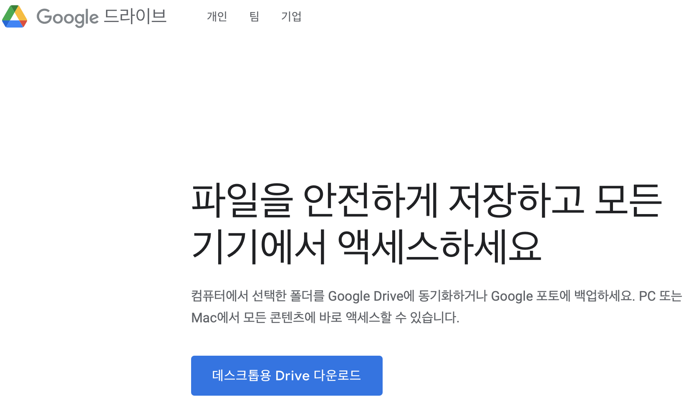

* Draft: 2021-10-22 (금)

# Google Drive 동기화하기
* 구글 검색: google drive for macos
> * https://www.google.com/drive/download/
사파리 웹브라우저에서 위의 링크에 접속한 다음, "데스크톱용 Drive 다운로드" 버튼을 클릭하면

 
프로그램을 자동으로 다운로드 받습니다.

