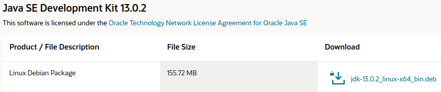
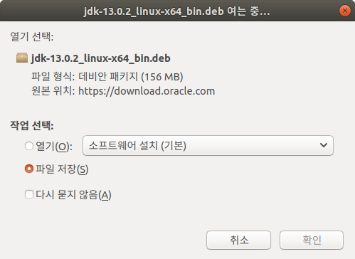

* Rev.2: 2020-08-07 (Fri)
* Rev.1: 2020-08-06 (Thu)
* Rev.1: 2020-05-21 (Thu)
* Draft: 2020-03-25 (Wed)

# Install Oracle JDK on Ubuntu 18.04 directly from the Oracle website
## Step 1. Download Oracle JDK directly from Oracle website.

Download "Linux Debian Package" from [Java SE Development Kit 13 Downloads](https://www.oracle.com/java/technologies/javase-jdk13-downloads.html).

Click `jdk-13.0.2_linux-x64_bin.deb`



Check `I reviewed ...` and click `Download jdk-13.0.2 ...`.


Sign into the account. Oracle Account Login is mandatory. To open an account, Oracle asks the company and job title, too.


A window pops up. Click `Save File` and then `OK`.



Then the download starts.

### License update


### wget no longer works
wget doesn't work any more. Download it from a web browser after accepting the license. 

```bash
Click the right version, accept the license and download the file.
$ wget https://download.oracle.com/otn-pub/java/jdk/14.0.1+7/664493ef4a6946b186ff29eb326336a2/jdk-14.0.1_linux-x64_bin.deb
$ ls
anaconda3  bin  h2o-3.30.0.3  h2o-3.30.0.3.zip  hands-ons  history.log  jdk-14.0.1_linux-x64_bin.deb  projects
$
```
See the error message. Install the .deb file from a web browser.
```bash
(base) user@d24d8fc9d727:~$ ls -al
  ...
-rw-r--r-- 1 user user      5307 Mar 20  2012 jdk-14.0.1_linux-x64_bin.deb
(base) user@d24d8fc9d727:~$ sudo dpkg -i jdk-14.0.1_linux-x64_bin.deb
dpkg: error processing archive jdk-14.0.1_linux-x64_bin.deb (--install):
 dpkg-deb --control subprocess returned error exit status 2
Errors were encountered while processing:
 jdk-14.0.1_linux-x64_bin.deb
$
```

## Step 2. Install the .deb File

```bash
$ sudo dpkg -i jdk-13.0.2_linux-x64_bin.deb
[sudo] h20의 암호: 
Selecting previously unselected package jdk-13.0.2.
(데이터베이스 읽는중 ...현재 172852개의 파일과 디렉터리가 설치되어 있습니다.)
Preparing to unpack jdk-13.0.2_linux-x64_bin.deb ...
Unpacking jdk-13.0.2 (13.0.2-1) ...
jdk-13.0.2 (13.0.2-1) 설정하는 중입니다 ...
$
```

## Step 3. Check the installation JDK version
```bash
$ sudo dpkg --list | grep -i jdk
ii  jdk-13.0.2                                 13.0.2-1                                         amd64        Java Platform Standard Edition Development Kit
iF  oracle-java11-installer-local              11.0.8-1~linuxuprising0                          amd64        Oracle Java(TM) Development Kit (JDK) 11
$
```
