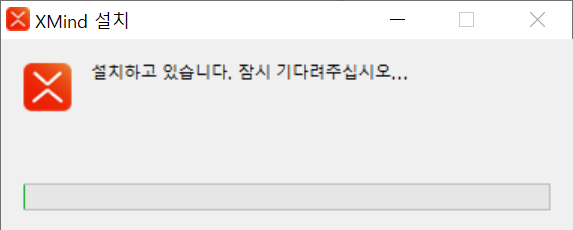
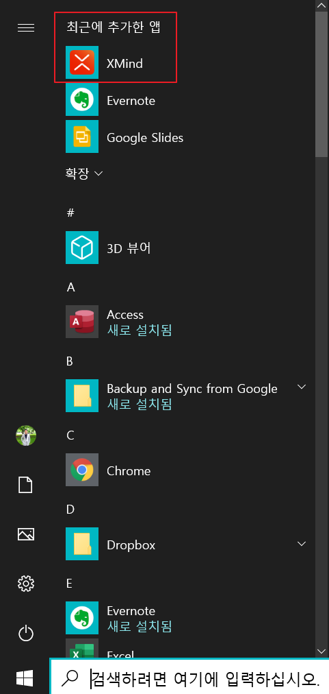

* Draft: 2020-11-21 (Sat)

# XMind 2020를 윈도우10에 설치하기

## 개요 (Overview)

마인드 매핑 도구인 XMind의 최신 버전 XMind 2020를 설치해봅니다. 

* 설치 환경: 윈도우10

XMind 2020와 XMind 8 모두 무료 버전이 있습니다만 XMind 2020를 선택한 이유는 두 가지 입니다.

* 최신 버전이므로 몇 가지 유용한 기능들이 더 추가 되었습니다.
  * CJK폰트 지원으로 한국어를 쓰는게 편리해졌습니다.
  * 모바일에서도 지원합니다.
  * 수식을 LaTeX 문법을 통해 지원합니다.

## 설치 파일 다운로드 하기

설치 파일은 두 가지 경로로 받을 수 있습니다. 

* XMind 2020 페이지
* XMind Download 페이지

설치파일의 예: `XMind-2020-for-Windows-64bit-10.2.1-202007272308.exe`

윈도우10에서 크롬 웹브라우저를 써서 페이지에 접속합니다.

### XMind 2020 페이지 https://www.xmind.net/xmind2020/

`Free Download`를 클릭할 경우 .exe파일을 받게 됩니다.

### XMind Download 페이지 https://www.xmind.net/download/

`Download for Windows`를 클릭할 경우 .exe파일을 받게 됩니다.

## 다운로드 받은 파일로 XMind 2020 설치하기

`다운로드` 폴더에 설치파일이 다운로드 될 경우, 해당 폴더로 이동해서 설치파일을 더블 클릭해서 실행합니다.

## 설치 확인 및 프로그램 실행 하기

윈도우키를 누른 후 `최신에 추가한 앱`에서 `XMind`를 보실 수 있습니다. `XMind` 아이콘을 클릭하면 프로그램이 실행됩니다.

## 다음
* [XMind 2020 프로그램 시작하기](LAUNCH.md)

