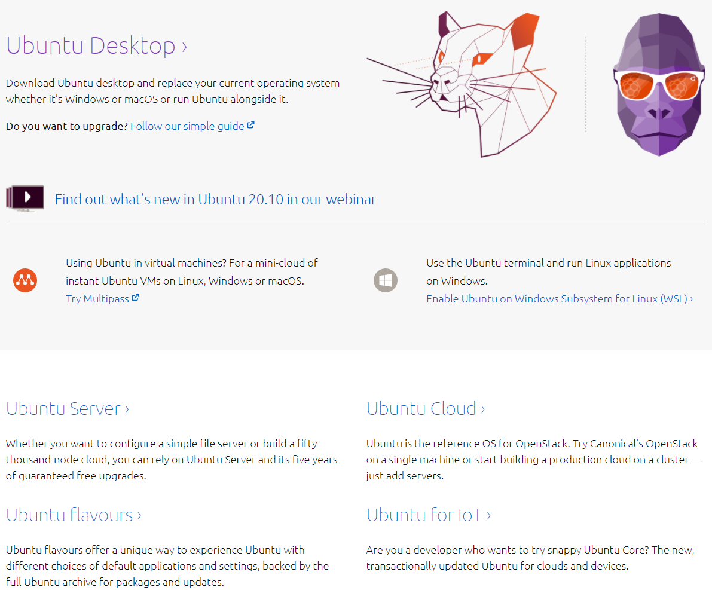
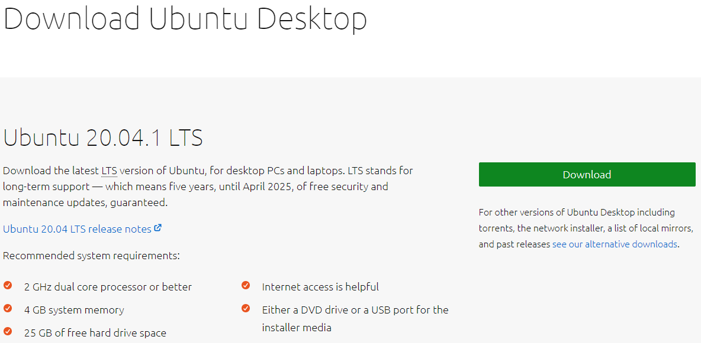
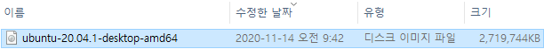

* Rev.1: 2020-12-01 (Tue)
* Draft: 2020-11-14 (Sat)

# 우분투 데스크탑 20.04 설치하기 (Install Ubuntu Desktop 20.04)

## 우분투 리눅스 설치 준비하기

### Step 1. 설치할 우분투OS 버전 선택하기

우분투 리눅스 20.04의 다운로드 페이지 [https://ubuntu.com/download](https://ubuntu.com/download)에 가면 몇 가지 선택사항이 있습니다.
* 우분투 데스크탑 (Ubuntu Desktop)
* 우분투 서버 (Ubuntu Server)
* 우분투 클라우드 (Ubuntu Cloud)
* IoT를 위한 우분투 (Ubuntu for IoT)
* 기타 우분투 종류들 (Ubuntu flavours)



이 중 일반 데스크탑 혹은 랩탑 사용자를 위한 "우분투 데스크탑 (Ubuntu Desktop)"을 클릭하면, "우분투 데스크탑 다운로드 페이지"로 이동합니다. 직접 입력하려면
[https://ubuntu.com/download/desktop](https://ubuntu.com/download/desktop)를 웹브라우저의 주소창에 입력하면 됩니다.

우측의 다운로드 (Download) 버튼을 클릭하면



### Step 2. 설치 파일 다운로드 하기

설치용 ISO파일의 다운로드가 시작됩니다. 다운로드가 완료되면 사용한 웹브라우저의 다운로드 폴더에 아래와 같은 파일이 보입니다.



이로써 설치파일 다운로드가 완료되었습니다.

### Step 3. ISO파일로 우분투 설치 USB메모리 생성하기

비어있는 USB 메모리를 이용해서 우분투 설치용 USB메모리를 생성합니다. 다운로드 받은 ISO파일을 쓰면 자동으로 부팅 가능한 USB메모리가 만들어 집니다. 자세한 내용은 [우분투 리눅스에서 부팅 USB 만들기](how_to/create_a_bootable_usb_disk.md)를 참고하세요.

## 우분투 리눅스 설치하기

### Step 3. BIOS설정을 변경합니다.

### Step 4. 우분투 설치 디스크로 부팅이 되면 설치를 진행합니다.

#### `Welcome`화면

Welcome아래에 있는 언어 선택 메뉴에서 `English`를 한국어로 변경합니다. 한국어는 메뉴의 제일 밑에서 4번째에 위치합니다. 메뉴에서 `Ctrl+end`키를 눌러서 최하단으로 바로 이동하거나, 스크롤바를 이용해서 이동하세요.

한국어
중국어(간체)
중국어(번체)
일본어

`설치`화면 우측의 `Ubuntu 설치` 버튼을 눌러서 설치를 시작합니다.

#### `키보드 레이아웃`

`계속하기` 버튼을 눌러서 기본 설정을 선택합니다. `Korean`, `Korean-Korean (101/104 keycompatible)`로 이미 선택되어 있습니다.

#### `무선 네트워크`

**WiFi 수신기가 컴퓨터에 연결/설치 되어 있는 경우에는 무선 네트워크 설정 메뉴가 나옵니다. 유선 네트워크만 설치된 경우엔 바로 다음 부분이 나옵니다.**

`계속하기` 버튼을 눌러서 기본 설정을 선택합니다. `지금은 무선 네트워크에 연결하지 않습니다`

접속할 무선 네트워크를 이미 알고 있다면 이 단계에서 설정하는게 더 간단합니다. 인증이 필요한 경우 비밀번호가 필요합니다.

#### `업데이트 및 기타 소프트웨어`

`계속하기` 버튼을 눌러서 기본 설정을 선택합니다. 기본 설정은

* `어떤 앱을 처음부터 설치 하시겠습니까?`는 `일반 설치`

* `기타 설정`은 `Ubuntu 설치 중 업데이트 다운로드`

입니다.

#### `설치 형식`

**Ubuntu를 단독으로 설치할 경우에 `계속하기` 버튼을 눌러서 진행합니다.**

이 컴퓨터에는 설치한 운영 체제가 없습니다. 어떻게 하시겠습니까?

* 디스크를 지우고 Ubuntu 설치

  경고: 이 작업은 모든 운영 체제에서 프로그램, 문서, 사진, 음악, 그리고 기타 파일을 삭제합니다.

  고급 기능  선택 안함

* 기타

  Ubuntu이(가) 사용할 파티션을 만들거나 크기를 바꾸거나 여러 파티션을 선택할 수 있습니다.

**윈도우즈가 이미 깔린 상태에서 듀얼부트 시스템을 만드려면** 

이 컴퓨터에는 Windows Boot Manager이(가) 설치되어 있습니다. 어떻게 하시겠습니까?

* `Windows Boot manager을(를) 그대로 두고 Ubuntu 설치`

가 선택된 상태에서 `계속하기` 버튼을 누릅니다.

**주의: `Windows Boot manager`가 이미 깔려있지만 인식이 안 되는 경우**

`기타`를 선택하고 `계속하기` 버튼을 클릭합니다.


#### `Windows Boot Manager`를 그대로 두고 Ubuntu 설치

윈도우즈와 우분투에 할당할 디스크 공간을 고려해서 조절합니다. 예를 들어

파일 (32.3 GB)     		Ubuntu

/dev/sda3 (ntfs)		/dev/sda3 (ntfs)

269.2 GB					242.8GB

와 같이 되어 있을 때 우분투에 최대한 공간을 많이 주고 싶습니다. 그래서

125.0 GB					397.0 GB

로 변경합니다.

`계속하기` 버튼을 누르면 경고창이 나옵니다.

```text
새 파티션 크기를 정하기 전에, 이전에 바뀐 사항을 모두 디스크에 써야합니다.
이 작업을 되돌릴 수는 없습니다.
크기 바꾸기 작업에 많은 시간이 걸릴 수도 있습니다.
```

`계속하기` 버튼을 클릭합니다.

```text
바뀐 점을 디스크에 쓰시겠습니까?

계속하시면 아래의 바뀐 사항을 디스크에 씁니다. 계속하지 않으시면 나중에 수동으로 설정을 바꿀 수 있습니다.

다음 장치의 파티션 테이블이 바뀌었습니다:

SCSI2 (0,0,0) (sda)

다음 파티션을 포맷합니다:
SCSI2 (0,0,0) (sda) 장치의 #4 파티션에 있는 ext4
```

`계속하기` 버튼을 누릅니다.

#### `어디에 거주하고 계십니까?`

`Seoul` `계속하기` 버튼을 누릅니다.

#### `당신은 누구십니까?`

이름, 컴퓨터 이름, 사용자 이름 선택, 암호 선택, 암호 확인에 값을 입력한 후

* 자동으로 로그인
* 로그인할 때 암호 입력

중 하나를 선택하고 `계속하기`를 누릅니다. 개인용 컴퓨터일 경우 `자동으로 로그인`을 선택하면 편합니다.

#### `우분투를 사용해주셔서 감사합니다`

설치가 진행됩니다. 

설치가 완료 되면 USB 메모리를 제거하고 제부팅하면 설치한 운영체제로 부팅됩니다.
