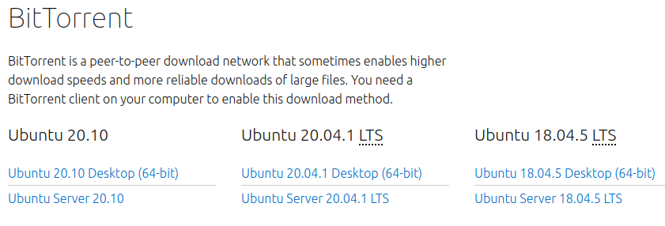
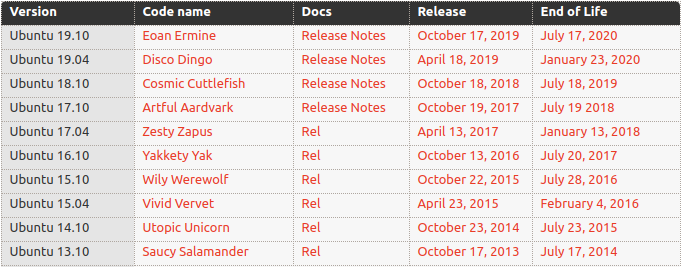
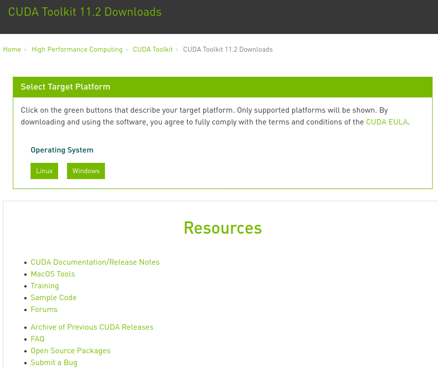
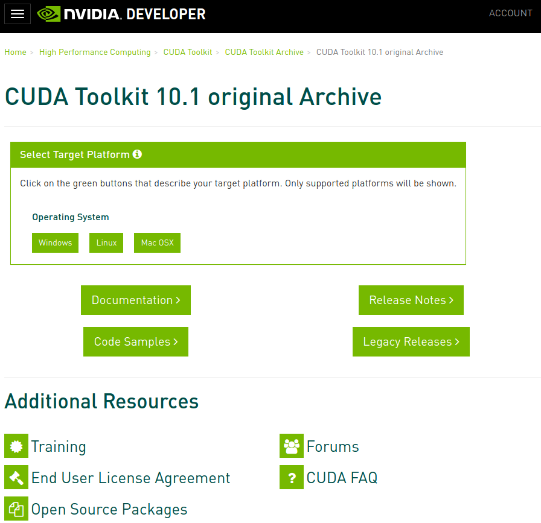
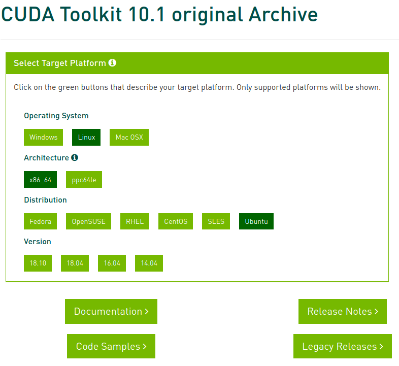

* Draft: 2021-01-15 (Fri)

# 최신 우분투 리눅스 버전 및 CUDA 버전 호환성 정리

## 요약

[우분투 위키의 릴리스](https://wiki.ubuntu.com/Releases) 페이지의 내용에서 최신 우분투 버전의 내용을 정리했습니다.

* 2021년 1월 현재 우분투 20.10이 최신 버전입니다.
* 일반적인 용도로 쓸 때는 그 앞 버전인 우분투 20.04을 사용합니다.
  * 가장 최신 버전을 설치했을 때 개발과 OS의 문제를 몇 번이나 경험했습니다.
  * 문제를 고치는데 몇 일 어떨 땐 한 주를 허비할 때도 있었습니다.
  * 최신 우분투 버전이 릴리스되면 설치해서 써본 다음, 특별한 이유가 아니면 안정적인 버전으로 돌아갑니다.
* GPGPU 연산 환경이 필요해서 NVIDIA 그래픽 드라이버 및 CUDA 라이브러리 등을 설치해야 할 때가 있습니다.
  * 머신러닝 프레임워크 텐서플로는
    * CUDA 10.1버전까지 지원합니다.
    * CUDA 10.1은 우분투 18.10까지 지원합니다.
    * 우분투의 다운로드 페이지에서 18.04를 다운로드 받을 수 있습니다. (18.10는 리스트에 없습니다.)
    * 그러므로 텐서플로를 쓸려면 현재로썬 우분투 18.04를 설치하고, CUDA 10.1를 설치합니다.

우분투 버전과 릴리스에 관한 자세한 내용은 [우분투 라이프 사이클과 릴리스 종료 (영문)]([Ubuntu Website release cycle page](https://www.ubuntu.com/about/release-cycle))를 참고하세요.

## 우분투 리눅스 버전(Ubuntu Linux versions)

### 다운로드 페이지

### 릴리스 리스트 (list of releases)

다음은 [우분투 위키의 릴리스](https://wiki.ubuntu.com/Releases) 페이지에서 발췌한 내용입니다.

#### 현재 (Current)

#### 종료 (End of Life)

## CUDA 버전 호환성

다운로드 홈페이지에 들어간 다음 `Resources`의 `Archive of Previous CUDA Releases`를 클릭해서 `이전 CUDA 릴리스 보관소`로 이동합니다.

이 중 목적으로 하는 10.1버전의 페이지를 클릭해서 이동합니다.

`CUDA Toolkit 10.1`보관소에서 필요한 파일을 다운로드 받게 됩니다.

OS와 컴퓨터에 맞게 선택을 하면 되는데 `18.04`를 선택합니다.

* 우분투의 경우 `18.10`이 CUDA 10.01이 지원하는 최신 우분투 버전처럼 보입니다.
* 하지만 우분투 홈페이지의 다운로드 페이지에는 18.10이 없고 18.04가 있습니다.
* 그러므로 18.04를 선택합니다.

