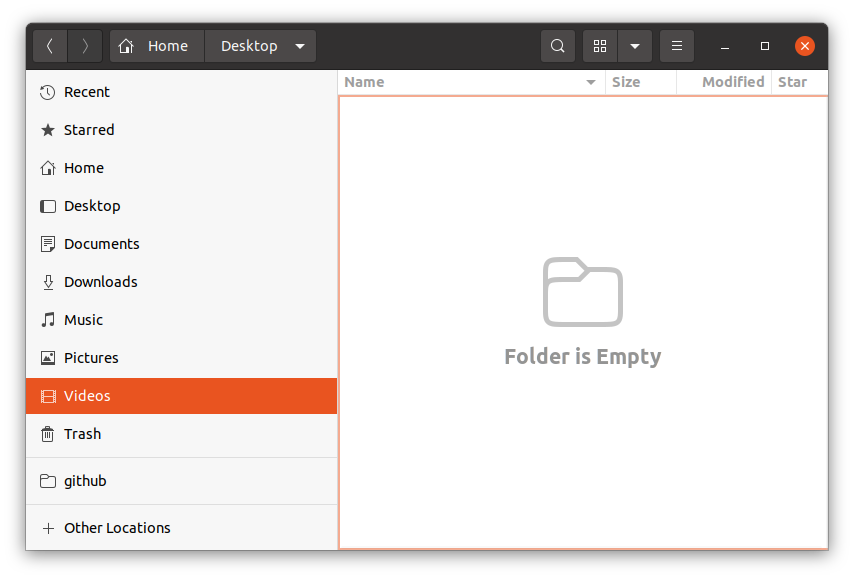

# How to Remove Default Folders
* Created: 2023-01-24 (Mon)
* Updated: 2023-01-24 (Mon)

## Purpose
In Files, I'll remove directories that I never use from the shortcuts in the left.
- Documents
- Music
- Videos



## References

Google search: Ubuntu remove default folders
- [How do I remove the default Music folder - Ask Ubuntu](https://askubuntu.com/questions/1336899/how-do-i-remove-the-default-music-folder)

```
There are two files that you need to edit:

    ~/.config/user-dirs.dirs
    /etc/xdg/user-dirs.defaults

Edit the first in a text editor of your choice and comment out the shortcut(s) you don't want. You can do this by putting a # at the start of the line.

Then edit the second file in a text editor of your choice via sudo, commenting out the shortcut(s) you don't want.

After both files are edited, log out and back in again to apply the change.
```

## Edit `~/.config/user-dirs.dirs`

```bash
$ nano ~/.config/user-dirs.dirs
```


Comment out unneccessary shortcuts.
```
#XDG_DESKTOP_DIR="$HOME/Desktop"
XDG_DOWNLOAD_DIR="$HOME/Downloads"
XDG_TEMPLATES_DIR="$HOME/"
XDG_PUBLICSHARE_DIR="$HOME/"
#XDG_DOCUMENTS_DIR="$HOME/Documents"
#XDG_MUSIC_DIR="$HOME/Music"
XDG_PICTURES_DIR="$HOME/Pictures"
#XDG_VIDEOS_DIR="$HOME/Videos"
```
Notice the change in Files.


## Edit `/etc/xdg/user-dirs.defaults`

```bash
$ sudo nano /etc/xdg/user-dirs.defaults
```


Comment out unneccessary default folders.
```
#DESKTOP=Desktop
DOWNLOAD=Downloads
TEMPLATES=Templates
PUBLICSHARE=Public
#DOCUMENTS=Documents
#MUSIC=Music
PICTURES=Pictures
#VIDEOS=Videos
```
## Delete unneccessary folders in Files
Right-click on an unneccessary folder.


Remove all unneccessary folders. I got what I want.


