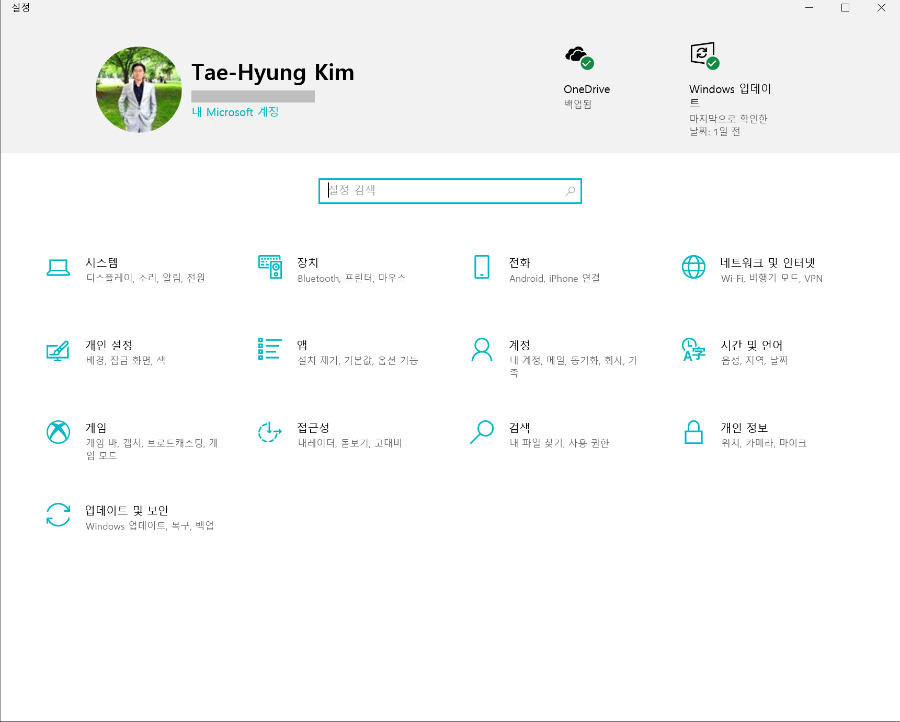
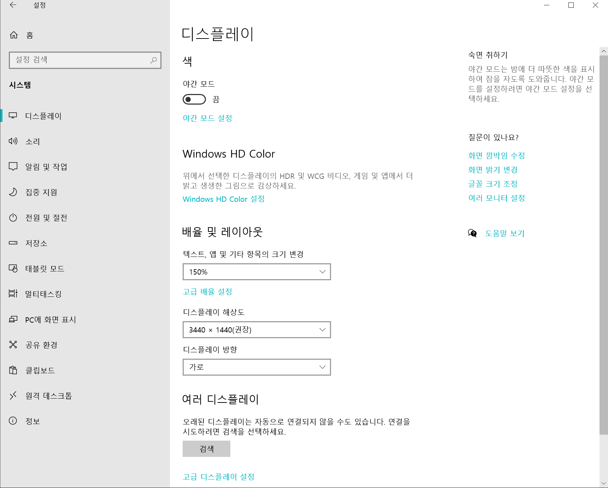
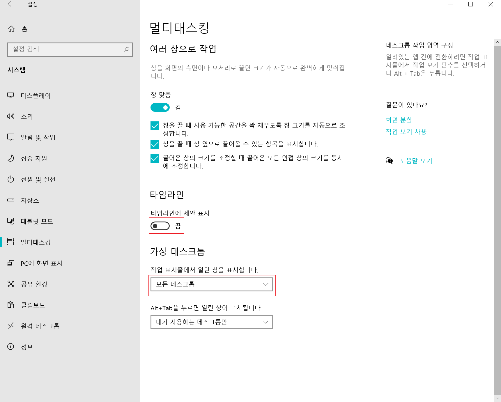
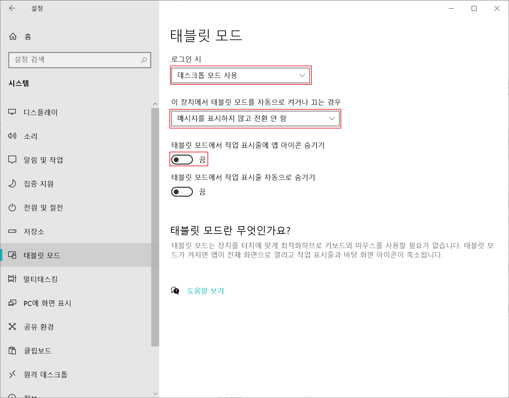

* 2020-11-21 (Sat)
# 윈도우 10 설정하기
여러가지 설정하는 방식이 있지만 성능 최적화를 위한 제어판 설정하는 방법입니다. 생산성 향상을 위해 아주 약간의 성능 최적화를 희생하였습니다.
* `시스템 > 멀티태스킹`에서 `창 맞춤` 기능은 끄지 않았습니다.

## 제어판

### 제어판 > 시스템 or 제어판 > 시스템 > 디스플레이

### 제어판 > 시스템 > 멀티태스킹

### 제어판 > 시스템 > 태블릿 모드

