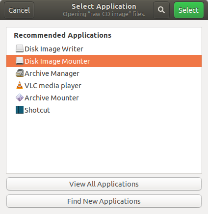
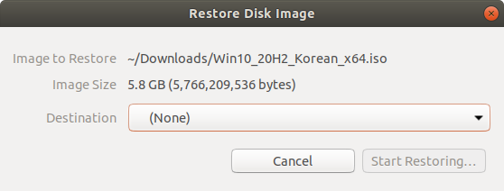
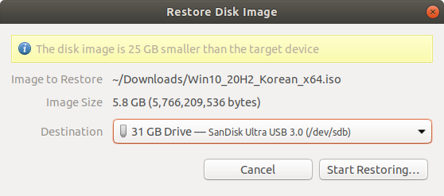
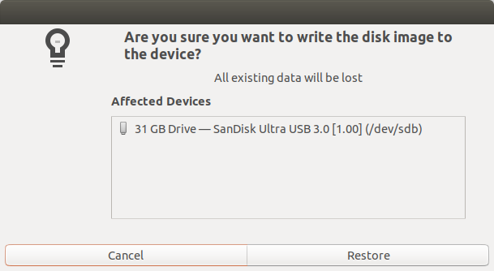
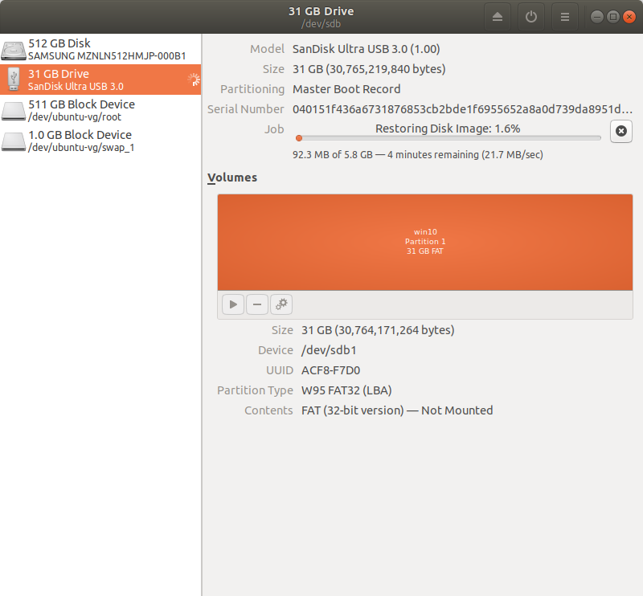
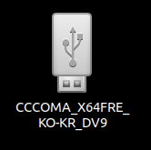

* Draft: 2020-11-16 (Mon)

# 우분투 리눅스에서 윈도우 10 설치 USB 만들기 (How to Create a Bootable USB for Windows 10 in Ubuntu Linux)
## 요약

`WoeUSB` 를 이용하는 모든 경우의 수를 시도해봤지만 실패했습니다. 이 명령어는 동작하지 않습니다. http://github/com/aimldl의 [environments/ubuntu_linux/linux_commands/woeusb.md](environments/ubuntu_linux/linux_commands/woeusb.md)를 참고하세요.

`WoeUSB`를 이용하는 것은 부팅이 안 되었습니다. 설치 명령어는

```bash
$ sudo add-apt-repository ppa:nilarimogard/webupd8
$ sudo apt update
$ sudo apt install -y woeusb
```

> In my test, 
>
> * the Windows 10 USB created with WoeUSB can boot in both legacy and UEFI mode on my old computer. 
> * On my new computer, it can boot in legacy mode but failed in UEFI mode. I don’t know the exact reason, but it’s probably because of bug in this software.
>
> Source: [How to Easily Create Windows 10 Bootable USB on Ubuntu or Any Linux Distro](https://www.linuxbabe.com/ubuntu/easily-create-windows-10-bootable-usb-ubuntu), LinuxBabe, 2020-06-03


## 개요 (Overview)

* 구글 검색: ubuntu how to create windows 10 booting usb
* 참고
  * [How to Create a Bootable Windows 10 USB in Linux](https://itsfoss.com/bootable-windows-usb-linux/), It's FOSS
  * [How to Easily Create Windows 10 Bootable USB on Ubuntu or Any Linux Distro](https://www.linuxbabe.com/ubuntu/easily-create-windows-10-bootable-usb-ubuntu), LinuxBabe, 2020-06-03

## 


## 

### 개략적인 절차

#### Step 1. 최소 8GB의 USB메모리를 준비합니다.

#### Step 2. 윈도우 10 ISO파일을 다운로드 받습니다.
* https://www.microsoft.com/en-in/software-download/windows10ISO
* 파일명: Win10_20H2_Korean_x64.iso
#### Step 3. USB 메모리를 포맷합니다.


#### Step 4. ISO파일에 있는 내용을 USB 메모리로 복사합니다.

### 
Ubuntu Linux에서 Disk tool을 사용합니다. 이 때 윈도우/리눅스 모두 사용할 수 있도록 선택합니다.


* https://www.microsoft.com/en-in/software-download/windows10ISO
* 파일명: Win10_20H2_Korean_x64.iso
위 링크에서 파일을 다운로드 받으면 ISO파일이 준비됩니다.

다음 단계는 

### Rufus
Rufus를 쓰면 부팅 USB 디스크를 간단히 만들 수 있지만 .exe파일이므로 우분투에서 사용할 수 없습니다.
* [RUFUS를 이용한 부팅 USB 제작 방법 (윈도우, WINPE, 리눅스 등)](http://korean-daeddo.blogspot.com/2016/01/rufus-usb-winpe.html)

### Disk Image Writer로 ISO파일을 USB 메모리에 쓰기
이 방법은 


네이버 검색: 우분투에서 윈도우10 usb 부팅디스크

https://blog.naver.com/kyy0810/221515930219

https://blog.naver.com/sinjoker/221242863908

https://jimnong.tistory.com/676


우선 ISO파일을 마운트합니다. ISO 우클릭하고 `Open With Disk Image Mounter`를 선택한 후 마운트를 하면, Desktop화면에 마운트됩니다.


마운트된 디렉토리를 더블클릭한 후,


디렉토리와 파일을 모두 선택 (Ctrl+A)해서 USB 메모리로 복사 (Ctrl+C & Ctrl+v)합니다.

### Step 4. 윈도우10 설치파일이 복사된 USB 메모리를 사용합니다.[How to Easily Create Windows 10 Bootable USB on Ubuntu or Any Linux Distro](https://www.linuxbabe.com/ubuntu/easily-create-windows-10-bootable-usb-ubuntu), LinuxBabe, 2020-06-03
복사가 끝나면 윈도우 10 설치 USB가 준비되었습니다.


## Disk Image Writer로 ISO파일을 USB 메모리에 쓰기
ISO파일을 우클릭해서 `Open with Other Application`을 선택한 후, 아래 화면처럼 진행하면 됩니다.













