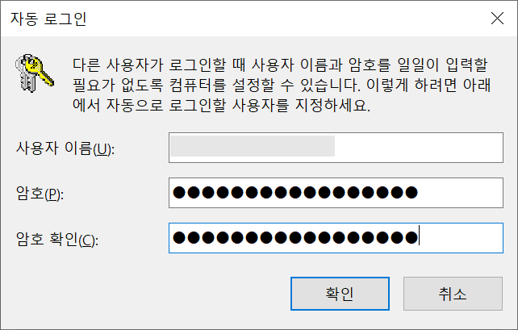

* Draft: 2020-11-25 (Wed)

# 윈도우10에 자동로그인 설정하기

부팅 후 암호 입력을 하지 않고 윈도우 10에 자동으로 로그인하도록 설정하는 방법

## 요약 (Summary)

* `netplwiz` 명령어로 `사용자 계정` 메뉴를 실행한 후 설정을 변경합니다.

* 자세한 내용은 참고 문서를 참고하세요.

## 과정

작업표시줄의 검색창에 `netplwiz` 를 입력한 후 명령 실행을 클릭합니다.

사용자 계정 창이 뜨면 체크 v된 것을 클릭해서

아래처럼 선택을 해제한 후 `적용(A)`버튼을 클릭합니다.

아래처럼 `자동 로그인`창이 나오면 `사용자 이름`과 `암호`를 입력한 후 `확인`버튼을 클릭합니다.

마지막으로 `확인`를 눌러서 창을 닫습니다.

컴퓨터를 재부팅해서 자동 로그인이 되는지 확인합니다.

## 참고 문서

* [윈도우 10 자동로그인 설정/해제 - 로그인 화면 없애기, IT게임Blog](https://dora-guide.com/windows-auto-login/)

